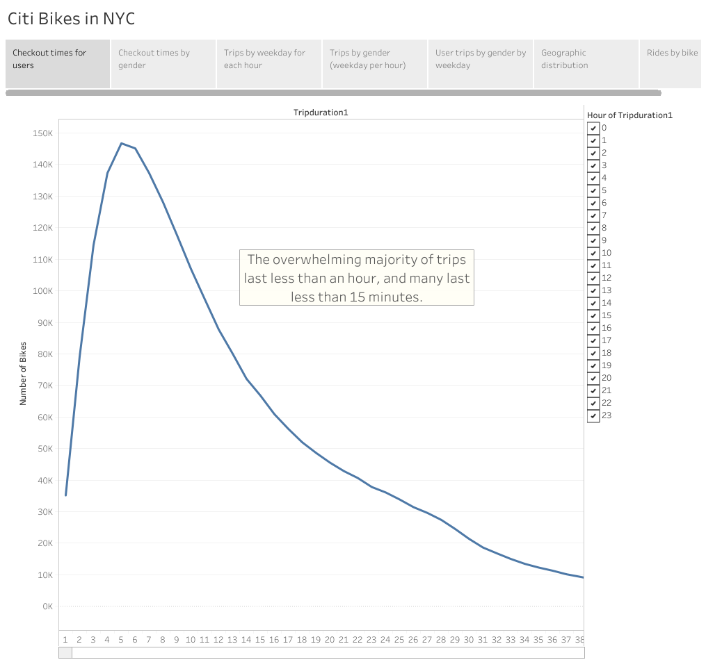

# Bikesharing

Columbia Data Science Module 14

## Bikesharing Overview
In this project, I have created a series of data visualizations in anticipation of a pitch meeting; we are going to propose a bikesharing system for Des Moines that operates similarly to the Citi Bike system in New York City. Fortunately, Citi has made the ride data publicly available [here:](https://www.citibikenyc.com/system-data)

For this project, I have used data from August 2019. I aim to answer the following questions: 
1) How long do trips typcically last? 
2) How does use behavior vary between men and women? 
3) What times are Citi Bikes most heavily used? 
4) Where are Citi Bikes used most often? 
5) How evenly are rides distributed across the bike fleet? 

## Resources
Data source: election_results.csv

Software: Jupyter Notebook, Python 3.8.6, Tableau Public 2020.4

## Results

