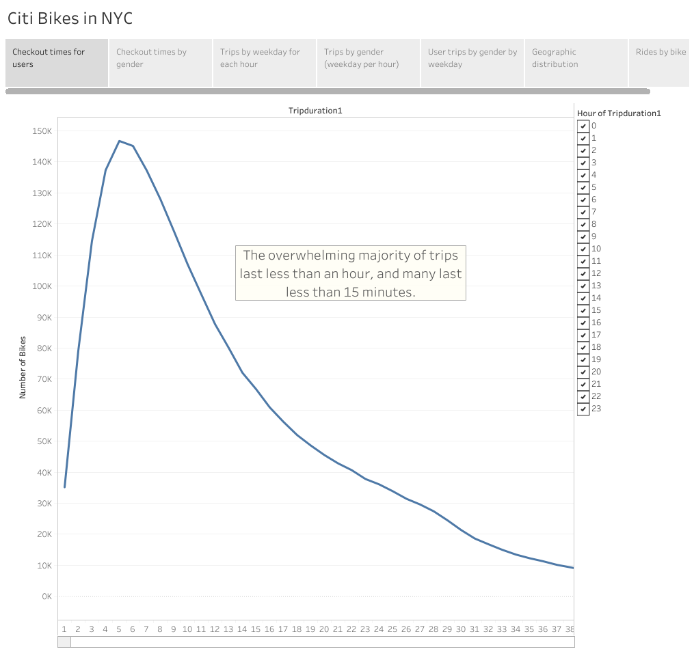
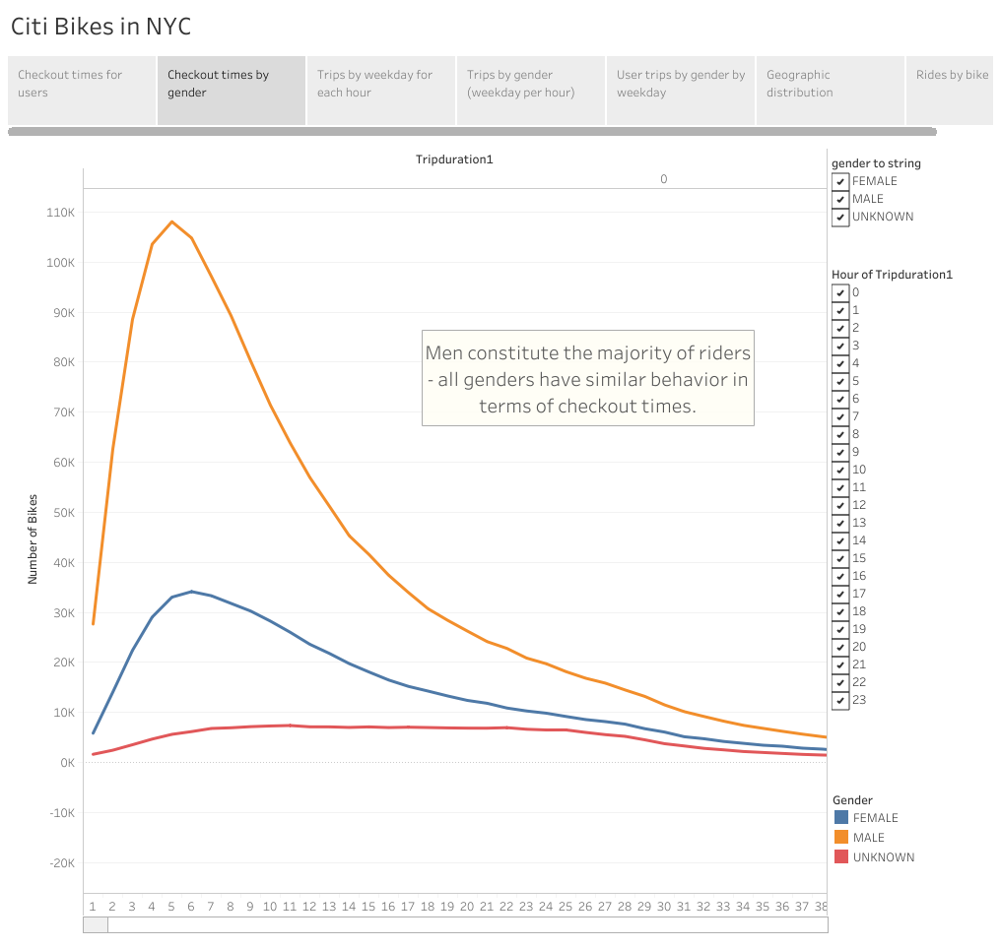
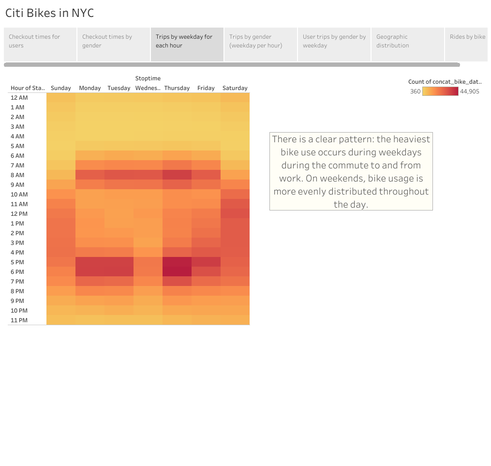
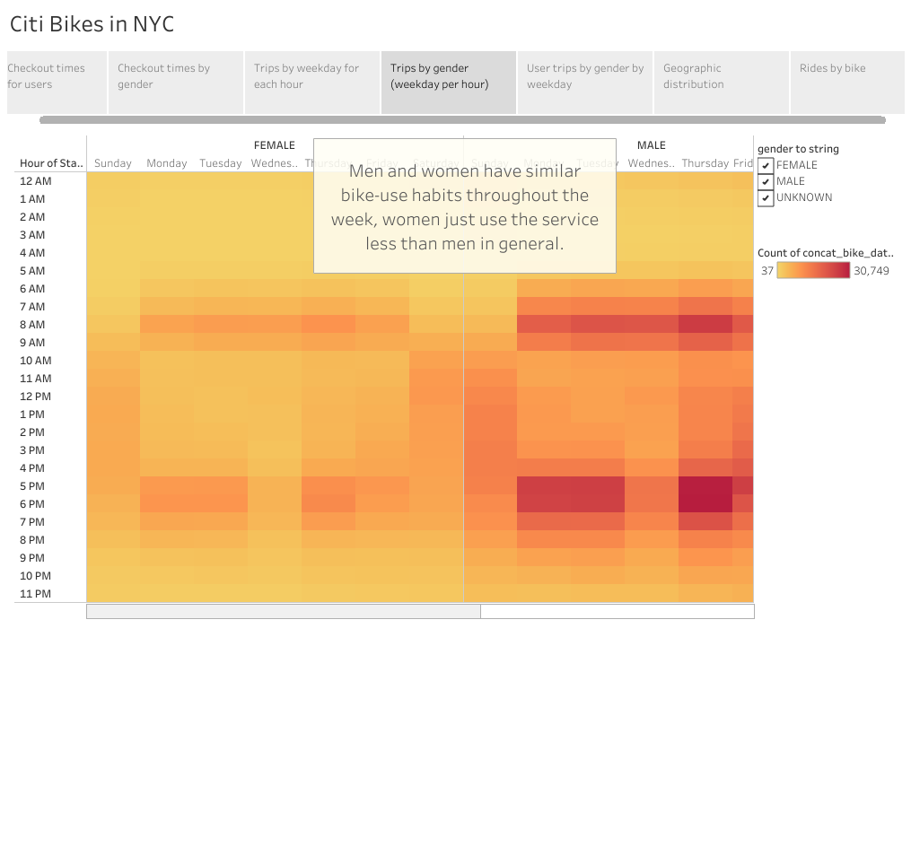
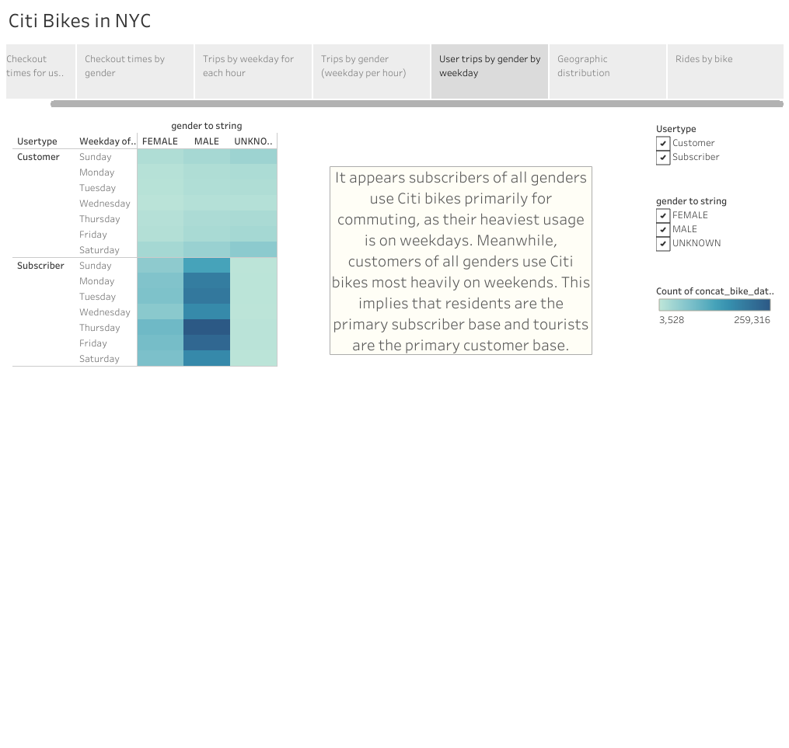
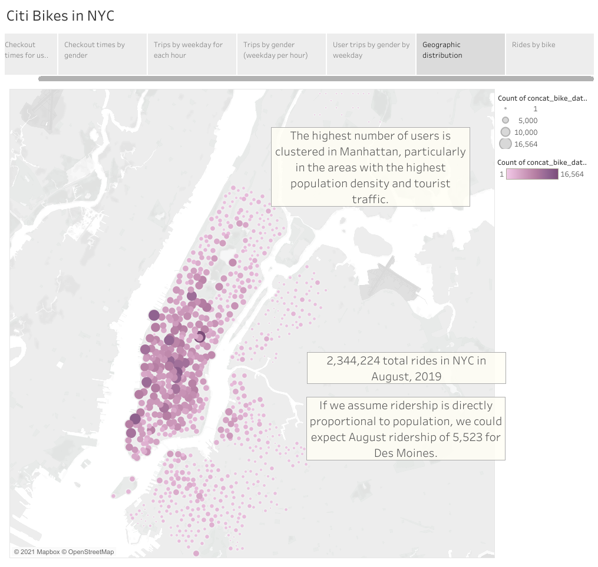
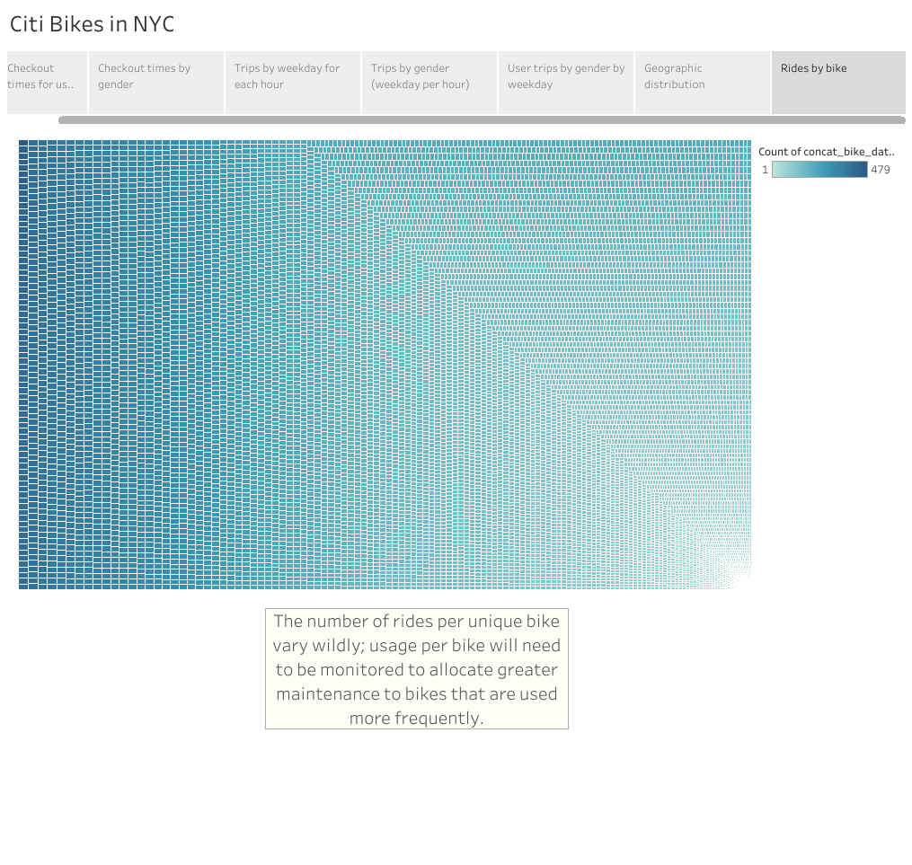

# Bikesharing

Columbia Data Science Module 14

**[Link to Tableau Story](https://public.tableau.com/profile/perry2045#!/vizhome/Module14ChallengeFinal_16155988479150/Story1?publish=yes)**

## Bikesharing Overview
In this project, I have created a series of data visualizations in anticipation of a pitch meeting; we are going to propose a bikesharing system for Des Moines that operates similarly to the Citi Bike system in New York City. Fortunately, Citi has made the ride data publicly available [here.](https://www.citibikenyc.com/system-data)

For this project, I have used data from August 2019. I aim to answer the following questions: 
1) How long do trips typcically last? 
2) How does use behavior vary between men and women? 
3) What times are Citi Bikes most heavily used? 
4) Where are Citi Bikes used most often? 
5) How evenly are rides distributed across the bike fleet? 

### Resources
Software: Jupyter Notebook, Python 3.8.6, Tableau Public 2020.4

Python packages: pandas

## Analysis

### Data Cleaning

## Results

The overwhelming majority of trips last less than an hour, and many last less than 15 minutes.

Men constitute the majority of riders - all genders have similar behavior in terms of checkout times.

There is a clear pattern: the heaviest bike use occurs during weekdays during the commute to and from work. On weekends, bike usage is more evenly distributed throughout the day. 

Men and women have similar bike-use habits throughout the week, women just use the service less than men in general.

It appears subscribers of all genders use Citi bikes primarily for commuting, as their heaviest usage is on weekdays. Meanwhile, customers of all genders use Citi bikes most heavily on weekends. This implies that residents are the primary subscriber base and tourists are the primary customer base.

The highest number of users is clustered in Manhattan, particularly in the areas with the highest population density and tourist traffic. There were 2,344,224 total rides in NYC in August, 2019. If we assume ridership is directly proportional to population, we could expect August ridership of 5,523 for Des Moines.

The number of rides per unique bike vary wildly; usage per bike will need to be monitored to allocate greater maintenance to bikes that are used more frequently.

## Summary

### Results
There are a few key takeaways as we look to implementing a bikesharing program in Des Moines. First, we will likely see relatively greater traffic from commuters during weekday rush hours as Des Moines is not as big of a tourist destination as NYC. Second, targeting will likely be initially more successful if aimed at men as the majority of Citi Bike users in NYC are men. 

### Future Analyses
There are a number of key deifferences between the NYC and Des Moines markets that are worthy of exploration. First, in NYC the large majority of rides lasted around 15 minutes, and almost all of them were less than an hour. However, NYC is much more densely packed than Des Moines. It is possible that ride times could be much greater in a place with urban sprawl. For that reason, it is worth investigating a ride sharing program in a city with greater urban sprawl. Second, it is important to consider the factor of weather. NYC has a much milder climate than Des Moines; it is reasonable to think that ridership in Des Moines will fall off much more steeply than in New York during the winter. For this reason, it would be worthwhile to investigate bikesharing programs in similarly cold Upper Midwestern/Great Lakes metro areas such as the Twin Cities, Milwaukee, or Chicago.

-----

### **Contact:**

**Email:** perry.abdulkadir@alumni.harvard.edu

**Linkedin:** https://www.linkedin.com/in/perry-abdulkadir-6a255199/
